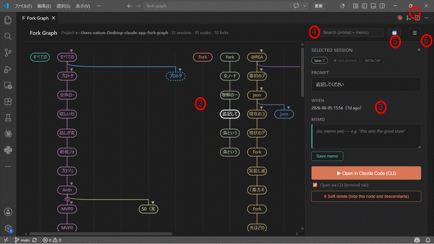

# Fork Graph

**See every fork of your Claude Code conversations as a git-graph — and jump back to "that good state" in one click.**

A VS Code extension that reads your local Claude Code session history (`~/.claude/projects/`), reconstructs the full fork genealogy across `/rewind`, *Fork conversation from here*, `--fork-session` and resumed sessions, and lets you annotate, search, and reopen any point in it.


## Why

Claude Code conversations branch constantly, and the judgment "this branch felt right" lives only in your head. Sessions get renamed IDs when forked, the official UI shows a flat list, and a week later "that good state" is unfindable. Fork Graph makes the genealogy visible and lets you pin subjective memos to it.

## Highlights

- 🌳 **Git-graph of all sessions** — cross-session forks are merged into one tree even though Claude Code rewrites IDs on fork (canonicalization by `timestamp + content`, with stable-ID secondary merge)
- 📝 **Memos & pins** that survive restarts, reloads, and forks
- ▶ **Reopen any node** via the official extension or a CLI terminal tab
- 🔍 **Text + calendar/time search**, pinned-only view, project switcher
- 🗑 **Soft delete with restore preview** — display-only; your session files are never written to
- ≈ **/compact markers**, auto reload, deleted-session detection, 4 languages

Full feature list: [docs/FEATURES.md](docs/FEATURES.md) (Japanese)

## UI at a glance



1. **Launch icon** in the editor title bar — or run **Fork Graph: Open** from the Command Palette
2. **The fork graph** — every prompt is a node; each lane is a branch born from a rewind or fork
3. **Detail panel** — full prompt, timestamp, memo & pin, soft delete, and *Open in Claude Code*
4. **Text search** across prompts and memos — non-matching nodes dim, so the genealogy stays visible
5. **Calendar search** — filter by date and time range (days that have chats are marked)
6. **Menu** — project folder switcher, language, pinned-only filter, restore soft-deleted branches

## Install / Use

The extension lives in [fork-graph-ext/](fork-graph-ext/) — see its [README](fork-graph-ext/README.md) (this is the Marketplace listing).

From source:

```bash
cd fork-graph-ext
npm install
npm run redeploy   # compile → package .vsix → install into VS Code
```

Then run **Fork Graph: Open** from the Command Palette.

## Documentation

This project was built investigation-first: the session file format and fork behavior were reverse-engineered from real data before any UI work, and every milestone left a design/implementation record. The docs are in Japanese.

| Doc | What it is |
| --- | --- |
| [docs/fork-graph.md](docs/fork-graph.md) | Concept: the pain point, core ideas, differentiation |
| [docs/ROADMAP.md](docs/ROADMAP.md) | Milestone plan S0–MVP6 (all shipped) with decisions and amendments |
| [docs/JSONL-FORMAT.md](docs/JSONL-FORMAT.md) | Full anatomy of Claude Code session `.jsonl` files (from real data) |
| [docs/S1-timestamp-merge-design.md](docs/S1-timestamp-merge-design.md) | The core algorithm: joining forked session files without stable IDs |
| [docs/PROTOTYPES.md](docs/PROTOTYPES.md) | UI prototypes spec ([live HTML](docs/prototypes/)) |
| [fork-graph-ext/docs/implementation/](fork-graph-ext/docs/implementation/) | Per-milestone implementation records |

## Contributing

Issues and PRs are welcome — see [CONTRIBUTING.md](CONTRIBUTING.md).

## License

[MIT](LICENSE)
